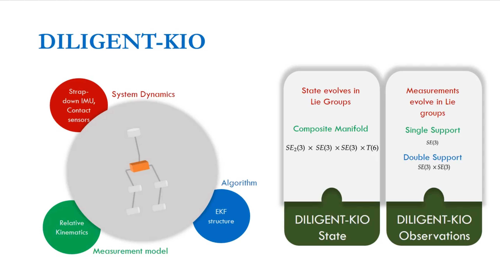

<h1 align="center">
DILIGENT-KIO: A Proprioceptive Base Estimator for Humanoid Robots using Extended Kalman Filtering on Matrix Lie Groups
</h1>

<div align="center">
Prashanth Ramadoss, Giulio Romualdi, Stefano Dafarra, Francisco Javier Andrade Chavez, Silvio Traversaro, Daniele Pucci
</div>

<p align="center"></p>

<div align="center">
  2021 International Conference on Robotics and Automation (ICRA)
</div>

<div align="center">
<a href="#usage"><b>Usage</b></a> |
<a href="https://ieeexplore.ieee.org/abstract/document/9561248"><b>Paper</b></a> |
<a href="https://arxiv.org/abs/2105.14914"><b>arXiv</b></a> |
<a href="https://www.youtube.com/watch?v=CaEZvbR9ZcA"><b>Video Presentation</b></a>
</div>

### Usage

Please see [`matlab/README.md`](./matlab/README.md) for an overview of the software implementation.

### Citing this work

If you find the work useful, please consider citing our preprint, while our publication is in process:

```
@INPROCEEDINGS{9561248,
  author={Ramadoss, Prashanth and Romualdi, Giulio and Dafarra, Stefano and Andrade Chavez, Francisco Javier and Traversaro, Silvio and Pucci, Daniele},
  booktitle={2021 IEEE International Conference on Robotics and Automation (ICRA)},
  title={DILIGENT-KIO: A Proprioceptive Base Estimator for Humanoid Robots using Extended Kalman Filtering on Matrix Lie Groups},
  year={2021},
  volume={},
  number={},
  pages={2904-2910},
  doi={10.1109/ICRA48506.2021.9561248}}
```


### Maintainer

This repository is maintained by:

| | |
|:---:|:---:|
| [](https://github.com/prashanthr05) | [Prashanth Ramadoss](https://github.com/prashanthr05) |
