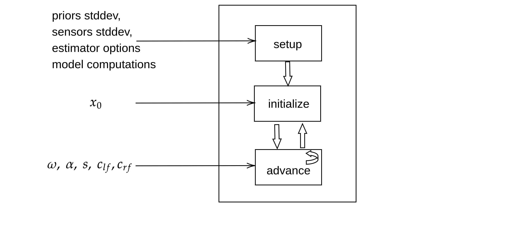

## Software

This repository includes sample MATLAB implementation of different filters for humanoid, floating base estimation based on an Extended Kalman Filter (EKF) based framework using proprioceptive measurements.

| Method                                                 | Implementation                                               | Please cite                                                  | Remark                                                       |
| ------------------------------------------------------ | ------------------------------------------------------------ | ------------------------------------------------------------ | ------------------------------------------------------------ |
| Observability Constrained quaternion based EKF (OCEKF) | [`Estimation.RotellaEstimator.Filter`](+Estimation/+RotellaEstimator/Filter.m) | N. Rotella, M. Bloesch, L. Righetti and S. Schaal, "State estimation for a humanoid robot," 2014 IEEE/RSJ International Conference on Intelligent Robots and Systems, 2014, pp. 952-958, doi: 10.1109/IROS.2014.6942674. |                                                              |
| Right Invariant EKF (InvEKF)                           | [`Estimation.InvEKF.Filter`](+Estimation/+InvEKF/Filter.m)   | Hartley, R., Ghaffari, M., Eustice, R. M., & Grizzle, J. W. (2020). Contact-aided invariant extended Kalman filtering for robot state estimation. The International Journal of Robotics Research, 39(4), 402–430. https://doi.org/10.1177/0278364919894385 | Re-implements the filter from https://github.com/UMich-BipedLab/Contact-Aided-Invariant-EKF within the scope of our notations and formats. |
| Simple Weighted Averaging (SWA)                        | [`Estimation.SimpleBipedEstimator.Filter`](+Estimation/+SimpleBipedEstimator/LO_IMU.m) | See [citing-this-work](https://github.com/dic-iit/ramadoss-2021-icra-proprioceptive_base_estimator#citing-this-work). |                                                              |
| DILIGENT-KIO                                           | [`Estimation.DLGEKF.Filter`](+Estimation/+DLGEKF/Filter.m)   | See [citing-this-work](https://github.com/dic-iit/ramadoss-2021-icra-proprioceptive_base_estimator#citing-this-work). |                                                              |

### Code Dependencies
The software has been tested with MATLAB R2020B. The required dependencies are,
- [iDynTree MATLAB Bindings](https://github.com/robotology/idyntree#bindings)
- MATLAB Curve Fitting Toolbox 

### How to run the filter

Calling `main` in a MATLAB console runs all the filters over a dataset collected from a walking experiment on `iCub` humanoid robot and plots the base pose and linear velocity estimates, along with the metric error computations.

A few high-level parameters include,

| Parameter         | Description                       | Type    | Options                     |
| ----------------- | --------------------------------- | ------- | --------------------------- |
| `experiment_name` | name of the experiment's mat file | string  | `walking` or `com-sinusoid` |
| `enable_ocekf`    | enable OCEKF computations         | boolean | `true` or `false`           |
| `enable_invekf`   | enable InvEKF computations | boolean |       `true` or `false`           |
| `enable_swa`   | enable SWA computations | boolean |       `true` or `false`           |
| `enable_diligent`   | enable DILIGENT-KIO computations | boolean |       `true` or `false`           |

The filter configuration and noise parameters can be modified from within the [`+Config`](./+Config) namespace. 

| Configuration file                                           | Description                                                  |
| ------------------------------------------------------------ | ------------------------------------------------------------ |
| [+Config/configMatlabPriors](./+Config/configMatlabPriors.m) | Set prior standard deviations for the EKF based estimator's internal state (OCEKF, InvEKF, DILIGENT-KIO). |
| [+Config/configMatlabSensorDev](./+Config/configMatlabSensorDev.m) | Set measurement noise and prediction model noise standard deviations  (OCEKF, InvEKF, DILIGENT-KIO). |
| [+Config/configSchmittParams](./+Config/configSchmittParams.m) | Set Schmitt Trigger parameters for contact detection based on contact normal forces |
| [+Config/configQEKFParams](./+Config/configQEKFParams.m)     | Set SWA-specific attitude estimator parameters (quaternion based EKF for attitude estimation) |

#### General architecture of the Estimators

All the filters are implemented in a similar architecture (mainly inspired from [UMich-BipedLab/Contact-Aided-Invariant-EKF](https://github.com/UMich-BipedLab/Contact-Aided-Invariant-EKF) and [BlockFactory](https://github.com/robotology/blockfactory) based thinking of a discrete system block). The architecture is described below,

- We call the one-time setup function for the filter by passing the [prior standard deviations](./+Estimation/+Proprioception/PriorsStdDev.m) for the system states, [sensor standard deviations](./+Estimation/+Proprioception/SensorsStdDev.m) for the available measurements and [estimator options](./+Estimation/+Proprioception/EstimatorOptions.m). All these parameters are available as structs in the [`Estimation.Proprioception`](./+Estimation/+Proprioception) namespace.
- We also additionally pass [`ModelComputations`](./+Model/ModelComputations.m) object to the filter during the setup phase which separates the model based computations (kinematics and dynamics) from the filter implementation.
- The filter is initialized with the initial state and the advance function is called in a loop by passing the contact states,  IMU and encoder measurements.
- Internally, the advance step runs the prediction and update steps for the filter.